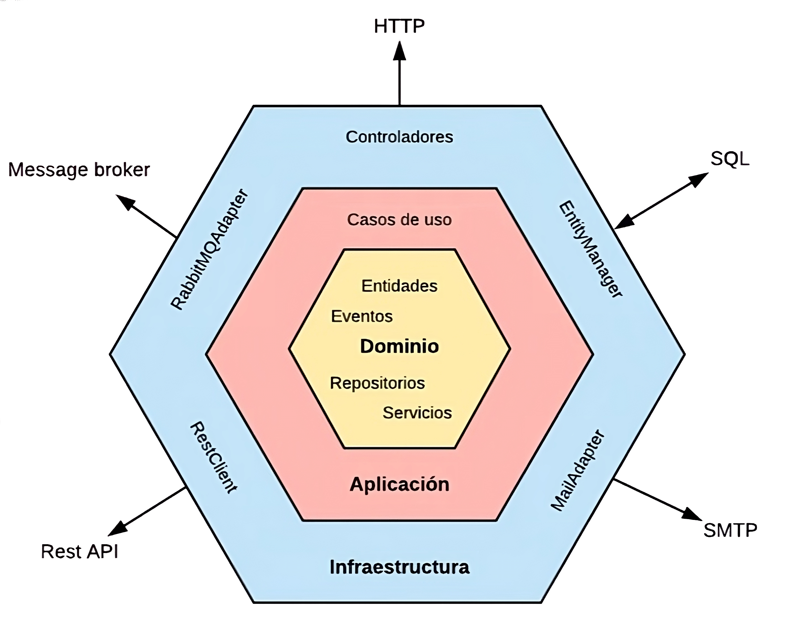
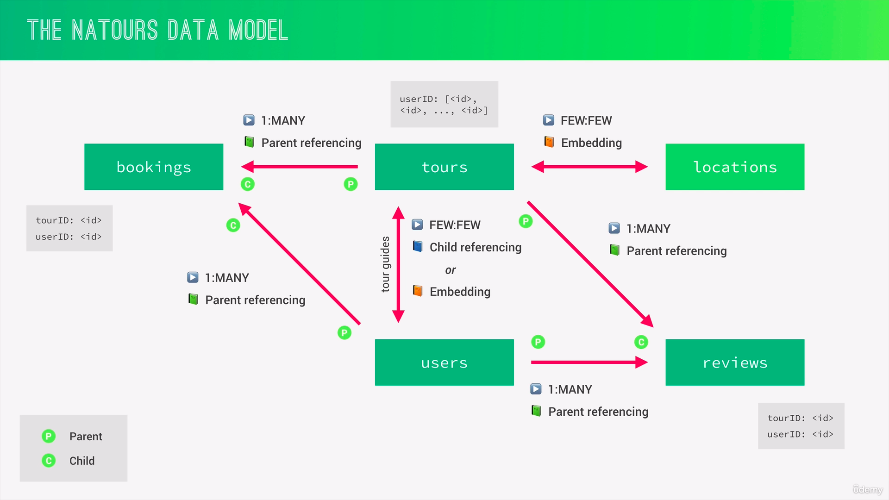

# Natours Server

This repository contains a Rest API server created with Node, Express and Typescript, using clean architecture and best development practices. It uses MongoDB DB.

## Hexagonal Architecture (Ports & Adapters) and DDD

The hexagonal architecture seeks to separate the business logic from the user interface and in turn from the external infrastructure. To do so, we divide the application into three main layers:

### Domain

A layer that is the most internal of all, (core of the application). Here are the essential components and modules that execute the main functions of the software. This central part is responsible for coordinating and managing the interactions between the various layers and elements of the system, ensuring efficiency, scalability and stability of the application.

**Important**: in this layer, the logic of the necigio is defined (DEFINITION != IMPLEMENTATION)

### Application

It is the one that contains the implementation of the services and the business logic.

### Infraestructura

It is the most external layer of all, where it connects with external applications, databases, API Rest, etc.

<table>
  <tr>
    <td align="center" valign="center"></td>
  </tr>
</table>

**Important**: The innermost layers cannot depend on external layers (dependency inversion principle). In other words, the domain layer cannot depend on any other layer. In turn, the application layer cannot depend on the infrastructure layer and must only communicate with the domain layer through ports.

- **Ports**: are used as communication bridges between the different layers of the application.
- **Adapters**: are used as external communication bridges for the application (other applications, external services, etc.). The adapters are located in the infrastructure layer.

## Installation

This project was generated with [Express](https://expressjs.com/)

Clone this repository

```bash
git clone https://github.com/baguilar6174/node-natours-server.git
```

Install dependencies

```bash
yarn
```

## Running the app

If you need local mongo database

- Install docker
- Run `docker-compose up -d` This command create a local volumen in root project to save data

- Rename `.env.template` to `.env` and add your environment variables
- Create initial data in your DB using the endpoint: _**GET**_ `http://localhost:3000/api/v1/tours/seed`
- Run `yarn dev`

If your want to create build production, run `yarn build`

## My process

### Built with

- Node
- Express
- Typescript
- MongoDB & Mongoose

### What I learned

- Fundamentals of Express (Node.js framework): routing, middleware, sending responses, etc.
- RESTful API design and development with advanced features: filtering, sorting, aliasing, pagination
- CRUD operations with MongoDB and Mongoose
- Fundamentals of Mongoose (MongoDB JS driver): Data models, CRUD operations, data validation, and middleware
- Using clean architecture
- How to work with data in NoSQL databases
- Use Mongo pipelines

## Development Features

- Clean Architecture
- Eslint and Prettier
- Good folder structure
- Complete authentication and authorization module

## TODO:

- Make responses with same format
- Rename files, classes and methods
- Create adapters
- API Documentation
- Alias path
- Verify mailhog with docker compose
- Get correct relationships between models Tour, User, Review
- Endpoint to delete all data

## Natours Server

- TODO: add api documentation...

<table>
  <tr>
    <td align="center" valign="center"></td>
  </tr>
</table>

## Stay in touch

- Website - [www.bryan-aguilar.com](https://www.bryan-aguilar.com/)
- Medium - [baguilar6174](https://baguilar6174.medium.com/)
- LinkeIn - [baguilar6174](https://www.linkedin.com/in/baguilar6174)
