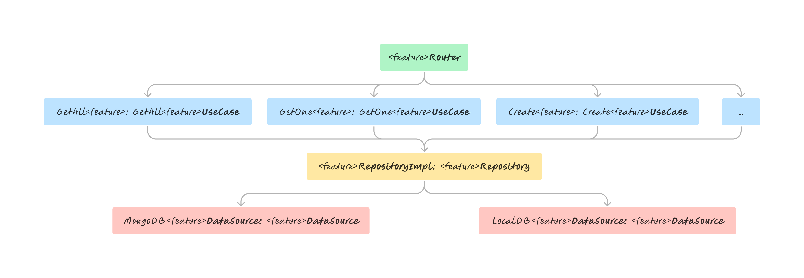

# Natours Server

...

## Clean Architecture: TypeScript Express API

By employing clean architecture, you can design applications with very low coupling and independent of technical implementation details. That way, the application becomes easy to maintain and flexible to change. Clean architecture allows us to create architectural boundaries between dependencies which allows components to be swapped in and out and be intrinsically testable.

<table>
  <tr>
    <td align="center" valign="center"></td>
  </tr>
</table>

## Installation

This project was generated with [Express](https://expressjs.com/)

Clone this repository

```bash
git clone https://github.com/baguilar6174/node-natours-server.git
```

Install dependencies

```bash
yarn
```

## Running the app

1. Run `yarn build`
2. Run `yarn dev`

## My process

### Built with

- Node
- Express
- Typescript

## Development Features

- Clean Architecture
- Eslint and Prettier
- Good folder structure

## TODO:

-

## Natours Server

- TODO: add api documentation...

## Stay in touch

- Website - [www.bryan-aguilar.com](https://www.bryan-aguilar.com/)
- Medium - [baguilar6174](https://baguilar6174.medium.com/)
- LinkeIn - [baguilar6174](https://www.linkedin.com/in/baguilar6174)
